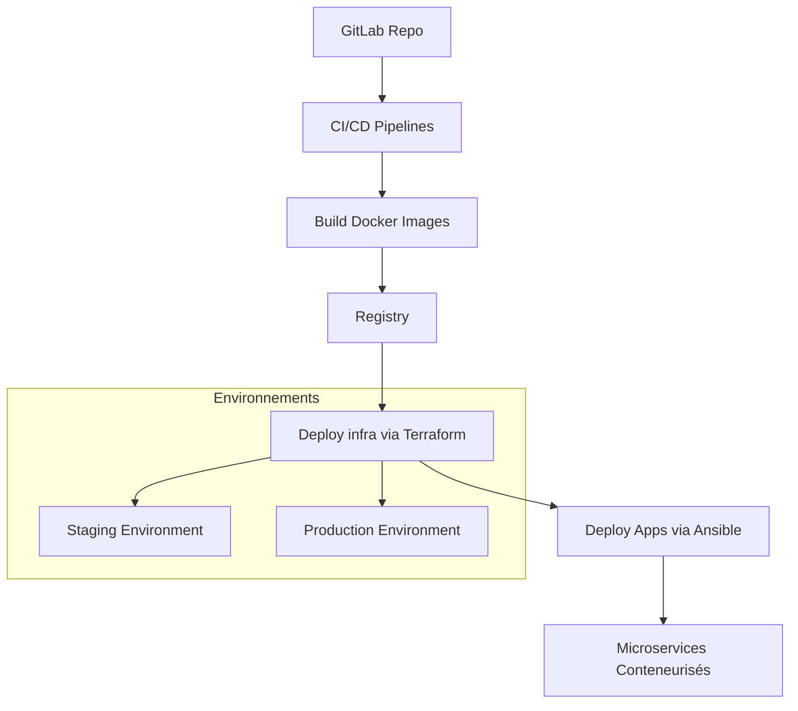

# Projet DevOps - Code Keeper

---

## 📖 Sommaire

- [Présentation du projet](#présentation-du-projet)
- [Architecture générale](#architecture-générale)
- [Organisation des dossiers](#organisation-des-dossiers)
- [Prérequis](#prérequis)
- [Installation et test local des microservices](#installation-et-test-local-des-microservices)
- [Gestion CI/CD avec GitLab](#gestion-cicd-avec-gitlab)
- [Déploiement de GitLab auto-hébergé avec Vagrant et Ansible](#déploiement-de-gitlab-auto-hébergé-avec-vagrant-et-ansible)
- [Provisionnement Infrastructure avec Terraform](#provisionnement-infrastructure-avec-terraform)
- [Déploiement automatique via pipelines](#déploiement-automatique-via-pipelines)
- [Sécurité et bonnes pratiques](#sécurité-et-bonnes-pratiques)
- [Outils utilisés](#outils-utilisés)
- [FAQ](#faq)
- [Contact](#contact)

---

## Présentation du projet

Ce projet a pour objectif la mise en place complète d’une chaîne DevOps pour une application composée de plusieurs microservices.  
Il inclut :

- **Intégration et déploiement continu (CI/CD)** via GitLab CI  
- **Conteneurisation** des services avec Docker  
- **Déploiement automatisé** d’une instance GitLab auto-hébergée (Vagrant + Ansible)  
- **Infrastructure as Code (IaC)** avec Terraform pour créer les environnements Staging et Production  
- **Documentation complète** pour faciliter la maintenance et l’évolution

---

## Architecture générale



---

## Organisation des dossiers

| Dossier                  | Description                            |
| ------------------------ | -------------------------------------- |
| `api-gateway-app/`       | Service API Gateway                    |
| `billing-app/`           | Service de facturation                 |
| `inventory-app/`         | Service gestion inventaire             |
| `postgres-db/`           | Image et scripts pour base PostgreSQL  |
| `rabbitmq/`              | Image et scripts pour RabbitMQ         |
| `gitlab-ansible-deploy/` | Playbook Ansible + Vagrant pour GitLab |
| `infrastructure-config/` | Terraform pour provisionnement cloud   |
| `docker-compose.yaml`    | Déploiement local multi-conteneurs     |

---

## Prérequis

- Docker (>= 20.x)
- Docker Compose (optionnel pour tests locaux)
- Vagrant & VirtualBox (pour déploiement GitLab local)
- Ansible (>= 2.9)
- Terraform (>= 1.0)
- GitLab (auto-hébergé ou SaaS)
- Accès à un registre Docker (GitLab Registry, Docker Hub…)

---

## Installation et test local des microservices

1. Clone le projet:
```
git clone https://github.com/seydi-ahmed/code-keeper.git
cd code-keeper
```

2. Pour chaque microservice (exemple api-gateway-app):
```
cd api-gateway-app
docker build -t api-gateway .
docker run -p 5000:5000 api-gateway
```

3. Tester l’accès via curl ou navigateur:
```
curl http://localhost:5000/health
```

4. Pour un déploiement local multi-services, utilise:
```
docker-compose up --build
```

---

## Gestion CI/CD avec GitLab

- Chaque microservice possède un fichier .gitlab-ci.yml qui définit les étapes: build, test, dockerize.
- Un pipeline est déclenché à chaque push sur les branches protégées (main, master, staging).
- Les images Docker sont automatiquement construites et poussées dans le registre GitLab.
- Le déploiement est automatisé sur les environnements Staging et Production via Terraform et Ansible.

---

## Déploiement de GitLab auto-hébergé avec Vagrant et Ansible

1. Positionne-toi dans gitlab-ansible-deploy/:
- cd gitlab-ansible-deploy
- vagrant up
- vagrant ssh
- sudo apt update
- sudo apt install python3-pip -y
- pip3 install ansible --upgrade
- export PATH=$HOME/.local/bin:$PATH
- ansible --version
- ansible-playbook -i /vagrant/hosts /vagrant/install_gitlab.yml
- sudo gitlab-ctl reconfigure
- sudo gitlab-ctl status


2. Le playbook installe et configure GitLab et ses runners sur la VM.

3. Vérifie le statut avec:
```
systemctl status gitlab-runsvdir.service
ansible-playbook --list-tasks install_gitlab.yml
```